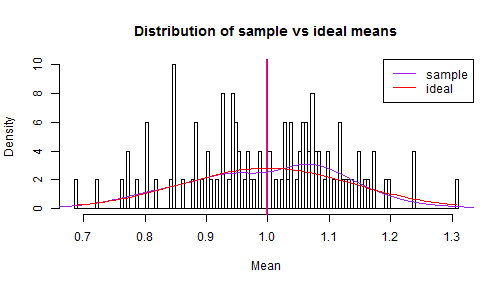

--- #titleSlide
title       : Demonstrating Central Limit Theorem
subtitle    : Developing Data Products Project
author      : Sid M
job         : 
framework   : io2012        # {io2012, html5slides, shower, dzslides, ...}
highlighter : highlight.js  # {highlight.js, prettify, highlight}
hitheme     : tomorrow      # 
widgets     : []            # {mathjax, quiz, bootstrap}
mode        : selfcontained # {standalone, draft}
knit        : slidify::knit2slides
--- .slide
<style>
.title-slide {
  background-color: #A5CBE7;
}
.title-slide hgroup > h1,
.title-slide hgroup > h2 {
  color: #43535E;
}

.slide {
  background-color: #A5CBE7;
}
</style>
## Motivation behind the application

- Mathematical concepts tend to be abstract - students often have trouble visualising the concepts being taught. A good way for people to learn is through the concept of play.
- Play is an unstructured, self-paced exploration into something that lasts until the subject loses interest in it.
- Thus, as long as one is playing, one is putting all their attention to the concept at hand.
- In the "Demonstrating the Central Limit Theorem" shiny app, we allow people to play with the various parameters (lambda, distribution size, iterations) that control Exponential Distributions.
- By playing with the parameters, students can visually understand relationships between the parameters, and how they affect the theorem. 
- Thus, students gain an innate understanding of how Central Limit Theorem works.

--- .slide

## The Central Limit Theorem application

In the application, the user is given 3 sliders: lambda, distribution size and iterations. These parameters affect the Exponential Distributions.

Initially, the values for distribution and iterations are kept deliberately low, to accentuate that the output of the dataset is far from the theoretical mean.

As the user manipulates the various sliders, they will begin to notice that the calculated outputs tend to the theoretical values; shown in the sidebar. A histogram prominently displayed in the middle of the page shows the distribution as well as the current and ideal means.

Once the user has raised the number of iterations far enough, they will notice the histogram showing a mostly normal distribution, coupled with the calculated values being very close to the theoretical values.  

This will serve as emperical evidence for the workings of the Central Limit Theorem.

--- .slide

## The code behind the application

The heart of the application is the following code that runs the exponential distributions:

```r
    getMeans <- function(iterations, sampleSize, lambda) {
      simulatedMean <- rep(0, iterations)
      for (i in 1 : iterations) {
        simulatedMean[i] <- mean(rexp(sampleSize, rate = lambda))
      }
      return(simulatedMean)
    }
```
The sliders manipulate the inputs to the function. As an example, generating an exponential distribution of 50 values 7 times with a lambda of 1 would look as such:

```r
getMeans(7, 50, 1)
```

```
## [1] 0.8982713 0.9499990 0.8851438 0.9398128 0.9567697 0.8277724 0.9032445
```

--- .slide

## Sample histogram
For 50 values, repeated 100 times with a lambda of 1, the output histogram would resemble:
 
## Link to App
You can view the application [here](https://sidm.shinyapps.io/project/)
